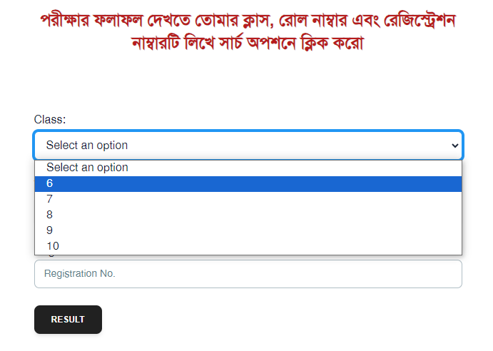
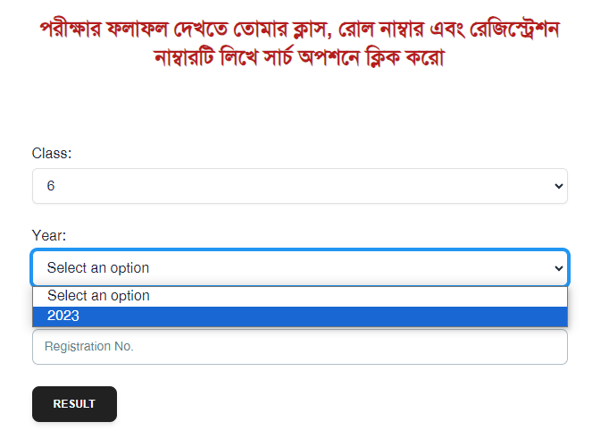
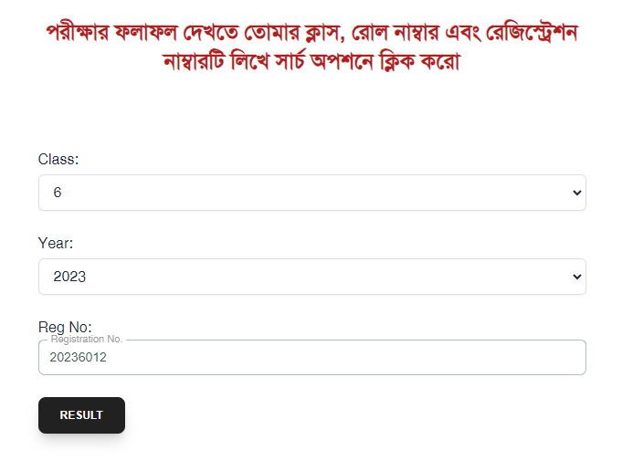

# Documentation

### Live url

https://sjmmhs-techasync.web.app/

### Result View

- Select an option from `Class` dropdown

---

  
  <br/>
  <br/>

- Select `Year` from the second dropdown. I only implemented 2023. So, `Year` is optional though.

---

  
  <br/>
  <br/>

- Following the format - we can put `Registration No.`
  as `2023[class][id/roll]`
- Example : [For class 6]

```
20236012
```

  
